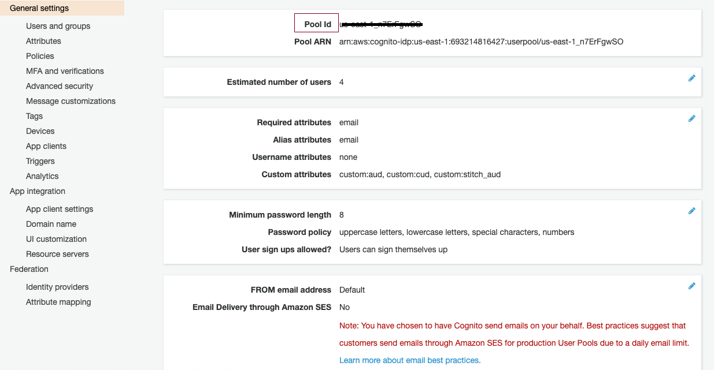
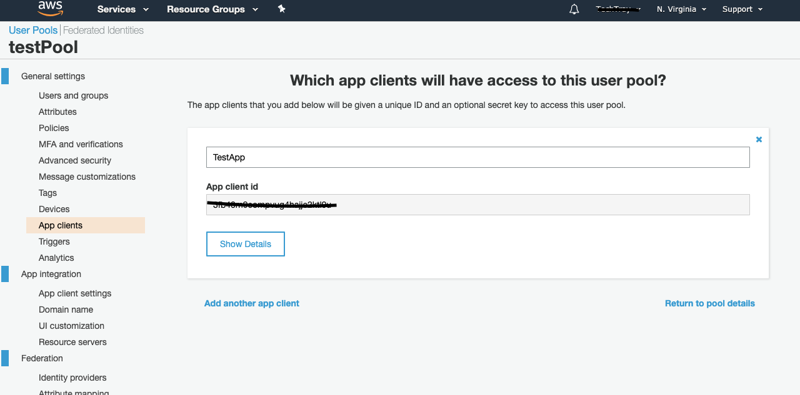
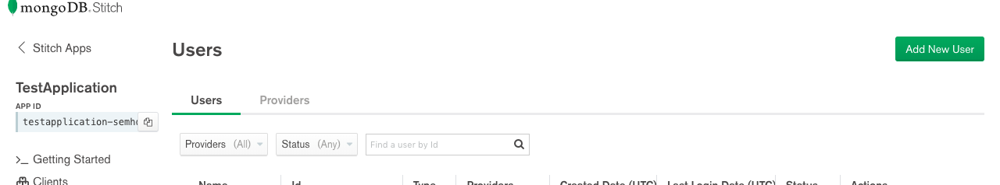
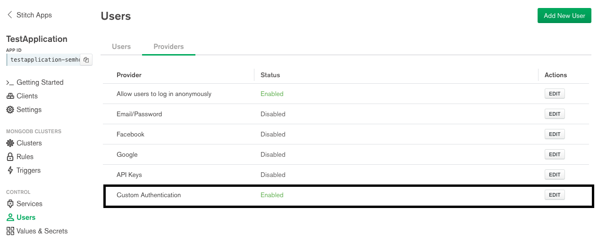
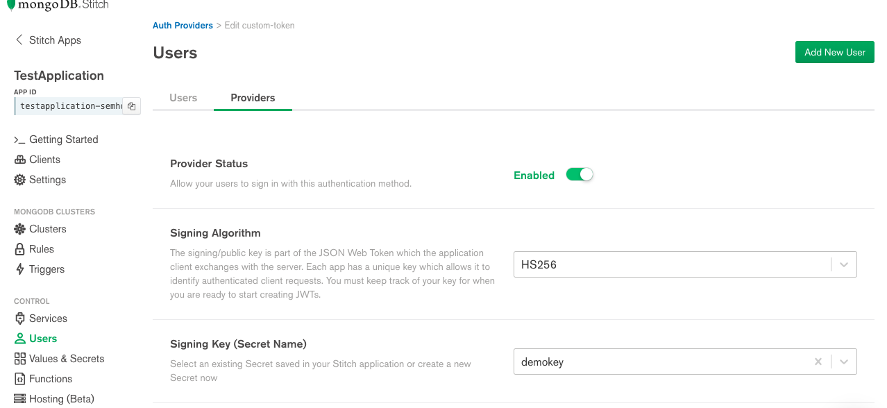
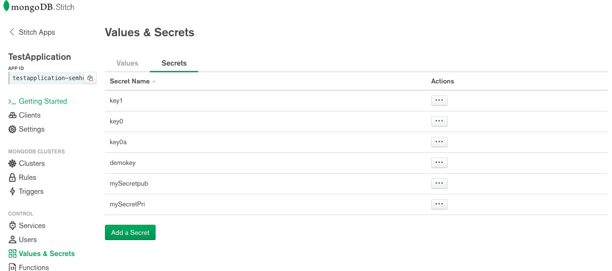
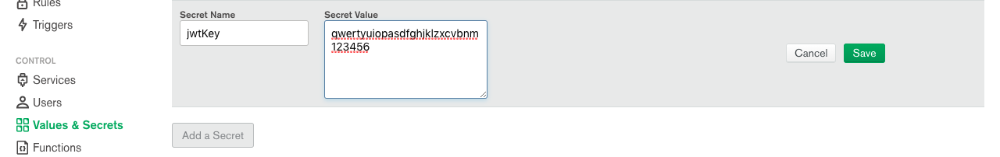

## React - AWS Cognito - MongoDb Stitch.

### Update src/config.json according to your aws and stitch configuration
```
{
  "cognito": {
    "REGION":"<REGION-AWS-USER-POOL>",
    "USER_POOL_ID":"<AWS-USER-POOL-ID>",
    "APP_CLIENT_ID":"<AWS-APP-CLIENT-ID>"
  },
  "stitch": {
    "appId": "<STITCH-APP-ID>", 
    "jwtKey" : "<KEY-FOR-GENERATING-JWT>"
  }
}
```

## Running the project
```
npm i
npm run start
```


## Screenshots for AWS and Stitch setup

#### get user pool Id from aws


#### AWS App Client ID


#### get Stitch App Id


#### setup Custom provider on stitch panel
>>stitch application >> users and providers



#### setup secret key on stitch panel


